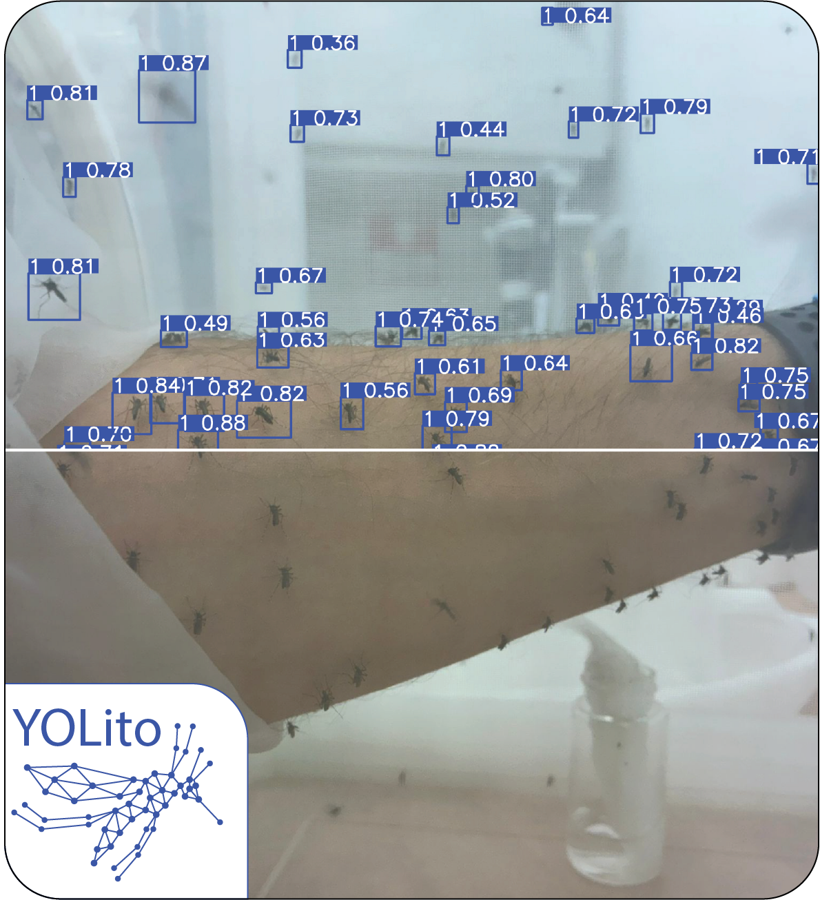

# YOLito: a generalized mosquito detector

**Universal YOLO-based mosquito detection, slicing, tracking, and behavioral analysis pipeline**

This repository provides a flexible, end-to-end deep learning pipeline for detecting and analyzing mosquito behavior using YOLito, with support for slicing, multi-video tracking, and postprocessing.

---
<p align="center">
  
</p>

## Features

-  **Inference** with pretrained YOLito
-  **SAHI slicing** for small-object detection
-  **Track ID continuity** across frames/videos
-  **Behavioral metrics** (visit count, duration, distance — available in tracking mode)
-  **Config-based execution** (no hardcoded paths)
-  **Plotting & heatmap visualization**

---

## 📦 Setup Instructions

### Editable install
Clone the repository and install it in editable (-e) mode:

```bash
cd path/to/YOLito
python -m pip install -e .
```

Installing the package registers the `yolito` console script and enables imports such as:

```python
from yolito import build_runtime_config, run_task

config = build_runtime_config("infer")
run_task(config)
```

The CLI respects the legacy arguments (`--task/--task`) while adding niceties like `--config` overrides and opt-out profiling. By default it still looks for YAML files under `configs/`, but you can point it somewhere else via the `--config` flag or the `yolito_CONFIG_DIR` environment variable when packaging the project inside Docker images.

---

## ⚙️ Configuration

All operations are driven by YAML files in the `configs/` folder:

- `infer.yaml`: defines model weights, paths, task type
- `analyze.yaml`: defines analysis logic

---

## Inference and Analysis Pipeline

### 🔹 `infer` task

The `infer` task performs object detection or tracking on a single video or a folder of videos.

#### 🔧 `infer.yaml` structure:
```yaml
images_dir: path/to/video/or/folder
model:
  weights: path/to/model.pt
  conf_threshold: confidence threshold for predictions
  iou_threshold: IoU threshold for NMS
  task: track / predict / slice
  vid_stride: 5  # Predict every Nth frame. Lower = more accurate tracking

output_dir: path/to/save/project  # Created automatically if not exists

sahi:
  slice_size: 640          # Slice each frame into 640×640 patches (recommended for this model)
  overlap_ratio: 0.2       # 20% overlap between adjacent slices for better detection coverage
  track: true              # Enable Kalman-filter tracking so sliced outputs get stable track_ids

save_animations: true      # Save predicted video
change_analyze_conf: true  # Automatically update configs/analyze.yaml
```

#### 📂 Expected input format for batch mode:
```
input_folder/
├── deet_rep1.mp4
├── deet_rep2.mp4
├── control_rep1.mp4
...
```

Each video should be named as:
```text
<treatment>_repX.mp4
```

When `change_analyze_conf: true`, the analyzer config is automatically updated based on inference results.

---

### 🔹 `analyze` task

The `analyze` task processes output from inference and computes behavioral metrics.

#### 🔧 `analyze.yaml` structure:
```yaml
input_csv: path/to/inference/results.csv  # Auto-filled if infer used with change_analyze_conf: true
output_dir: path/to/output/folder

settings:
  interval_unit: minutes  # or 'seconds'
  filter_time_intervals: 15  # Limit duration of analysis
  fps: 25  # Original FPS ÷ vid_stride

  stat: sum  # How to summarize: sum, mean, or median
  time_intervals: 1  # Time binning (e.g. every 1 min)
  treatment_or_image_name: treatment  # Use treatment or replicates in plots

heatmap:
  grid_size: 30  # Higher = finer resolution (smaller grid cells)
  image_path: path/to/project/frames
  min_count: 1  # Minimum visits to display
  true_axis: true  # Plot in real pixel space

plotxy:
  id_OR_class: class  # 'id' = unique trajectories, 'class' = object type
  treatment_or_image_name: image_name
  true_axis: true

task:
  distance: true
  duration: true
  heatmap: true
  plotxy: true
  visits: true
```

---

## 📈 Analysis Outputs

- **Visits** Count of trajectory visits per time interval
- **Duration** Total or average presence time of trajectories per interval
- **Distance** Total or average distance traveled per interval
- **Heatmaps** Density of trajectories across the frame
- **X vs Y scatter plots** Position distribution of detected objects over time

All results are saved as `.csv` summaries and visual plots in the configured output directory.

---

## Usage

> The `yolito` console script becomes available only after installing the package
> (e.g., `python -m pip install -e .`). You can always fall back to
> `python -m yolito` if you prefer not to install it.

### Run Inference
```bash
python main.py --task infer
# or, after installing the package:
yolito --task infer
```

### Run Analysis
```bash
python main.py --task analyze
# or
yolito --task analyze
```

---

## Output Structure

- `results.csv`: merged behavior metrics
- `videos/`, `frames/`, `csvs/`: organized intermediate outputs
- `.png` plots: for visits, heatmaps, trajectories

## Resources

### Training Dataset
The complete YOLito dataset, comprising the original high-resolution mosquito images and the SAHI-generated 640×640 slices used for training and validation, is available upon request and will be publicly available upon publication:

📁 **Dataset (Google Drive)**  
[https://drive.google.com/drive/u/2/folders/1VQT-yOwJU7Cx8EghayYC-4GGgZPcxuBD](https://drive.google.com/drive/folders/1VQT-yOwJU7Cx8EghayYC-4GGgZPcxuBD?usp=sharing)

Contents include:
- Original images
- 640×640 SAHI-sliced training and validation tiles
- Test dataset (unseen images)  

## Citation

If you use **YOLito**, its dataset, model weights, or analysis toolkit in your research, please cite our preprint:

> **YOLito: A generalizable model for automated mosquito detection**  
> *bioRxiv*, 2025  
> [https://doi.org/10.1101/2025.11.20.689454](https://doi.org/10.1101/2025.11.20.689454)

###  BibTeX
```bibtex
@article{Sar-Shalom2025.11.20.689454,
  title   = {YOLito: A generalizable model for automated mosquito detection},
  author  = {Sar-Shalom, Evyatar and Kassner, Ziv and Sarig, Arad and Vinauger, Clément and Coutinho-Abreu, Iliano and Triana, Merybeth F. and Bouzada, Lucía I. and Pitts, R. Jason and Stensmyr, Marcus C. and Akbari, Omar S. and Papathanos, Philippos A. and Bohbot, Jonathan D.},
  journal = {bioRxiv},
  year    = {2025},
  doi     = {10.1101/2025.11.20.689454},
  url     = {https://www.biorxiv.org/content/early/2025/11/21/2025.11.20.689454}
}
```
## Contact

For questions, bug reports or collaboration inquiries, please contact:  
**Evyatar Sar-Shalom**  or **Jonathan Bohbot**  
Department of Entomology, The Hebrew University of Jerusalem  
the Neurobiology of Insect Olfaction Lab  
**evyatar.sar-shalom@mail.huji.ac.il**  
**jonathan.bohbot@mail.huji.ac.il**

## Acknowledgments

YOLito was developed in the  
**the Neurobiology of Insect Olfaction Lab**,  
Department of Entomology, The Hebrew University of Jerusalem.

We thank our collaborators across multiple laboratories for contributing mosquito specimens, supplying diverse image datasets, and offering valuable feedback that supported the development of YOLito.
